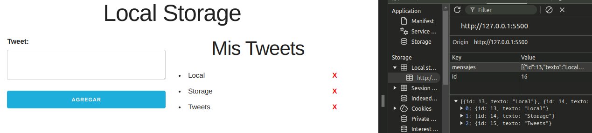

# A02-ProyectoMensajes-LocalStorage

Formulario que permite a los usuarios ingresar mensajes y los muestra en un contenedor en tiempo real. 

**Descripción:**

En esta actividad, se te pide que desarrolles,  en JavaScript,  las funcionalidades del proyecto; Un formulario que permite a los usuarios ingresar mensajes y los muestra en un contenedor en tiempo real. Tamien tendremos la funcionalidad de eliminnar mensajes de la lista. Debes asegurarte de que estos mensajes se almacenen en el navegador, lo que permitirá que los mensajes permanezcan incluso después de recargar la página.

**Entrega:**

Sube un enlace al repositorio de github del proyecto.
Asegúrate de que el repositorio sea público o de que me invites como colaborador.
